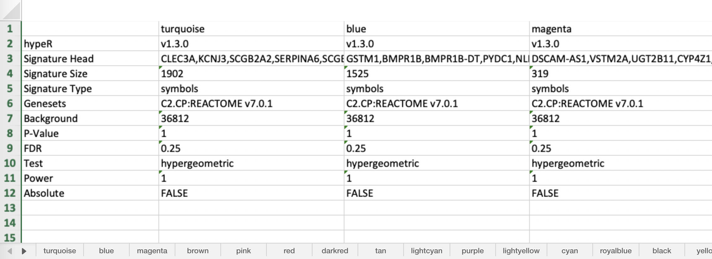

```{r, include=FALSE}
knitr::opts_chunk$set(comment="", cache=FALSE, messages=FALSE, warnings=FALSE, fig.align="center")
devtools::load_all(".")
library(hypeR)
library(tidyverse)
library(reactable)
```

# Requirements

We recommend the latest version of R (\>= 4.0.0) but **hypeR** currently requires R (\>= 3.6.0) to be installed directly from Github or Bioconductor.

# Installation

Install the development version of the package from Github.

```{r, eval=FALSE}
devtools::install_github("montilab/hypeR")
```

Or install the development version of the package from Bioconductor.

```{r, eval=FALSE}
BiocManager::install("montilab/hypeR", version="devel")
```

# Usage
```{r, eval=FALSE}
library(hypeR)
library(tidyverse)
library(reactable)
```

# Data
```{r}
load(file.path(system.file("extdat", package="hyperworkshop"), "limma.rda"))
load(file.path(system.file("extdat", package="hyperworkshop"), "wgcna.rda"))
```

```{r}
signatures <- wgcna[[1]]
str(signatures)

genesets <- msigdb_gsets("Homo sapiens", "C2", "CP:KEGG", clean=TRUE)
print(genesets)
```

```{r, message=FALSE, warning=FALSE, results='hide'}
mhyp <- hypeR(signatures, genesets, test="hypergeometric", background=36000)
```

```{r, fig.width=8, fig.height=8, fig.align='center'}
hyp_dots(mhyp, merge=TRUE, fdr=0.05, top=40, title="Co-expression Modules")
```

**Why hypeR?**

- Written purely in R 
- Designed to make your life easier
- Flexible functionality and parameters
- Able to process hundreds of signatures simultaneously   
- Dynamic visualizations for large amounts of data
- Highly reproducible workflows
- Report generation for sharing with collaborators

***

# Geneset Enrichment 101

## Terminology

All analyses with __hypeR__ must include one or more signatures and genesets.

### Signature
There are multiple types of enrichment analyses (e.g. hypergeometric, kstest, gsea) one can perform. Depending on the type, different kinds of signatures are expected. There are three types of signatures `hypeR()` expects.

```{r}
# Simply a character vector of symbols (hypergeometric)
signature <- c("GENE1", "GENE2", "GENE3")

# A ranked character vector of symbols (kstest)
ranked.signature <- c("GENE2", "GENE1", "GENE3")

# A ranked named numerical vector of symbols with ranking weights (gsea)
weighted.signature <- c("GENE2"=1.22, "GENE1"=0.94, "GENE3"=0.77)
```

### Geneset
A geneset is simply a list of vectors, therefore, one can use any custom geneset in their analyses, as long as it's appropriately defined. Additionally, `hypeR()` recognized object oriented genesets called `gsets` objects, described later.

```{r}
genesets <- list("GSET1" = c("GENE1", "GENE2", "GENE3"),
                 "GSET2" = c("GENE4", "GENE5", "GENE6"),
                 "GSET3" = c("GENE7", "GENE8", "GENE9"))
```

Using a differential expression dataframe created with Limma, we will extract a signature of upregulated genes for use with a *hypergeometric* test and rank genes descending by their differential expression level for use with a *kstest*.

```{r}
reactable(limma, rownames=FALSE)
```

We'll also import the latest genesets from [Kegg](https://www.kegg.jp) using another set of functions provided by __hypeR__ for downloading and loading hundreds of open source genesets. 

```{r}
genesets <- msigdb_gsets("Homo sapiens", "C2", "CP:KEGG", clean=TRUE)
```

## Enrichment Methods

All workflows begin with performing enrichment with `hypeR()`. Often we're just interested in a single signature, as described above. In this case, `hypeR()` will return a `hyp` object. This object contains relevant information to the enrichment results, as well as plots for each geneset tested, and is recognized by downstream methods.

The most basic signature is an unranked vector of genes. This could be a differential expression signature, module of co-expressed genes, etc. As an example, we use the differential expression dataframe to filter genes that are upregulated (t > 0) and are sufficiently significant (fdr < 0.001), then extract the gene symbol column as a vector.

### Unranked Signature

```{r}
signature <- limma %>% 
             dplyr::filter(t > 0 & fdr < 0.001) %>% 
             magrittr::use_series(symbol)
```

```{r}
length(signature)
head(signature)
```

```{r}
hyp_obj <- hypeR(signature, genesets, test="hypergeometric", background=50000, fdr=0.01, plotting=TRUE)
hyp_obj$plots[[1]]
```

### Ranked Signature

Rather than setting a specific cutoff to define a differential expression signature, one could rank genes by their expression and provide the entire ranked vector as signature. From the differential expression dataframe, we order genes descending so upregulated genes are near the top, then extract the gene symbol column as a vector.

```{r}
signature <- limma %>% 
             dplyr::arrange(desc(t)) %>% 
             magrittr::use_series(symbol)
```

```{r}
length(signature)
head(signature)
```

```{r}
hyp_obj <- hypeR(signature, genesets, test="kstest", fdr=0.05, plotting=TRUE)
hyp_obj$plots[[1]]
```

### Weighted Signature

In addition to providing a ranked signature, one could also add weights by including the t-statistic of the differential expression. From the differential expression dataframe, we order genes descending so upregulated genes are near the top, then extract and deframe the gene symbol and t-statistic columns as a named vector of weights.

```{r}
signature <- limma %>% 
             dplyr::arrange(desc(t)) %>% 
             dplyr::select(symbol, t) %>% 
             tibble::deframe()
```

```{r}
length(signature)
head(signature)
```

```{r}
hyp_obj <- hypeR(signature, genesets, test="kstest", fdr=0.05, plotting=TRUE)
hyp_obj$plots[[1]]
```

A `hyp` object contains all information relevant to the enrichment analysis, including the parameters used, a dataframe of results, plots for each geneset tested, as well as the arguments used to perform the analysis. All downstream functions used for analysis, visualization, and reporting recognize `hyp` objects and utilize their data. Adopting an object oriented framework brings modularity to hypeR, enabling flexible and reproducible workflows.

```{r}
print(hyp_obj)
```

## The `hyp` Methods
```{r, eval=FALSE}
# Show interactive table
hyp_show(hyp_obj)

# Plot dots plot
hyp_dots(hyp_obj)

# Plot enrichment map
hyp_emap(hyp_obj)

# Plot hiearchy map
hyp_hmap(hyp_obj)

# Save to excel
hyp_to_excel(hyp_obj)

# Save to table
hyp_to_table(hyp_obj)

# Generate markdown report
hyp_to_rmd(hyp_obj)
```

# Downloading Genesets

## Object Oriented Genesets

Genesets are simply a named list of character vectors which can be directly passed to `hyper()`. Alternatively, one can pass a `gsets` object, which can retain the name and version of the genesets one uses. This versioning will be included when exporting results or generating reports, which will ensure your results are reproducible.

```{r}
genesets <- list("GSET1" = c("GENE1", "GENE2", "GENE3"),
                 "GSET2" = c("GENE4", "GENE6"),
                 "GSET3" = c("GENE7", "GENE8", "GENE9"))
```

Creating a `gsets` object is easy...

```{r}
genesets <- gsets$new(genesets, name="Example Genesets", version="v1.0")
print(genesets)
```

And can be passed directly to `hyper()`...

```{r eval=FALSE}
hypeR(signature, genesets)
```

To aid in workflow efficiency, __hypeR__ enables users to download genesets, wrapped as `gsets` objects, from multiple data sources.

## Downloading **msigdb** Genesets

Most researchers will find the genesets hosted by [msigdb](https://software.broadinstitute.org/gsea/msigdb/collections.jsp) are adequate to perform geneset enrichment analysis. There are various types of genesets available across multiple species.

```{r}
msigdb_info()
```

Here we download the Hallmarks genesets...

```{r}
HALLMARK <- msigdb_gsets(species="Homo sapiens", category="H")
print(HALLMARK)
```

We can also clean them up by removing the first leading common substring...

```{r}
HALLMARK <- msigdb_gsets(species="Homo sapiens", category="H", clean=TRUE)
print(HALLMARK)
```

This can be passed directly to `hypeR()`...

```{r eval=FALSE}
hypeR(signature, genesets=HALLMARK)
```

Other commonly used genesets include Biocarta, Kegg, and Reactome...

```{r, eval=FALSE}
BIOCARTA <- msigdb_gsets(species="Homo sapiens", category="C2", subcategory="CP:BIOCARTA")
KEGG     <- msigdb_gsets(species="Homo sapiens", category="C2", subcategory="CP:KEGG")
REACTOME <- msigdb_gsets(species="Homo sapiens", category="C2", subcategory="CP:REACTOME")
```

## Downloading **enrichr** Genesets

If msigdb genesets are not sufficient, we have also provided another set of functions for downloading and loading other publicly available genesets. This is facilitated by interfacing with the publicly available [libraries](https://amp.pharm.mssm.edu/Enrichr/#stats) hosted by [enrichr](https://amp.pharm.mssm.edu/Enrichr/).

```{r}
available <- enrichr_available()
reactable(available)
```

```{r}
KEGG <- enrichr_gsets("KEGG_2019_Human")
print(KEGG)
```

Note: These libraries do not have a systematic versioning scheme, however the date downloaded will be recorded.

Additionally download other species if you aren't working with human or mouse genes!

```{r eval=FALSE}
yeast <- enrichr_gsets("GO_Biological_Process_2018", db="YeastEnrichr")
worm <- enrichr_gsets("GO_Biological_Process_2018", db="WormEnrichr")
fish <- enrichr_gsets("GO_Biological_Process_2018", db="FishEnrichr")
fly <- enrichr_gsets("GO_Biological_Process_2018", db="FlyEnrichr")
```

# Visualization
```{r}
signature <- limma %>% 
             dplyr::arrange(desc(t)) %>% 
             magrittr::use_series(symbol)

head(signature)
```

```{r}
genesets <- msigdb_gsets("Homo sapiens", "C2", "CP:REACTOME", clean=TRUE)

hyp_obj <- hypeR(signature, genesets, test="kstest", fdr=0.01)
```

To visualize the results, just pass the `hyp` object to any downstream functions.

## Dots Plot

One can visualize the top enriched genesets using `hyp_dots()` which returns a horizontal dots plot. Each dot is a geneset, where the color represents the significance and the size signifies the geneset size.

```{r, fig.width=8, fig.height=6, fig.align='center'}
hyp_dots(hyp_obj)
```

## Enrichment Map

One can visualize the top enriched genesets using `hyp_emap()` which will return an enrichment map. Each node represents a geneset, where the shade of red indicates the normalized significance of enrichment. Hover over the node to view the raw value. Edges represent geneset similarity, calculated by either jaccard or overlap similarity metrics.

```{r, fig.width=9, fig.height=9, fig.align='center'}
hyp_emap(hyp_obj, similarity_cutoff=0.70)
```

## Hiearchy Map

When dealing with hundreds of genesets, it's often useful to understand the relationships between them. This allows researchers to summarize many enriched pathways as more general biological processes. To do this, we rely on curated relationships defined between them.

### Relational Genesets

For example, [Reactome](https://reactome.org/) conveniently defines their genesets in a [hiearchy of pathways](https://reactome.org/PathwayBrowser/). This data can be formatted into a relational genesets object called `rgsets`. 

```{r}
genesets <- hyperdb_rgsets("REACTOME", version="70.0")
```

Relational genesets have three data atrributes including gsets, nodes, and edges. The `genesets` attribute includes the geneset information for the leaf nodes of the hiearchy, the `nodes` attribute describes all nodes in the hierarchy, including internal nodes, and the `edges` attribute describes the edges in the hiearchy.

```{r}
print(genesets)
```

Passing relational genesets works natively with `hypeR()`.

```{r}
hyp_obj <- hypeR(signature, genesets, test="kstest", fdr=0.01)
```

One can visualize the top enriched genesets using `hyp_hmap()` which will return a hiearchy map. Each node represents a geneset, where the shade of the gold border indicates the normalized significance of enrichment. Hover over the leaf nodes to view the raw value. Double click internal nodes to cluster their first degree connections. Edges represent a directed relationship between genesets in the hiearchy. Note: This function only works when the `hyp` object was inialized with an `rgsets` object.

```{r, fig.width=9, fig.height=9, fig.align='center'}
hyp_hmap(hyp_obj, top=30)
```

# Use Case: Gene Co-Expression Analysis

Often computational biologists must process, interpret, and share large amounts of biological data. A common example is interpreting gene co-expression modules across one or more phenotype, resulting in potentially hundreds of signatures to annotate. Here we have signatures of gene co-expression modules, generated with WGCNA, for multiple breast cancer subtypes 


**Problem:** Annotate gene co-expression modules across one or more phenotype, resulting in potentially hundreds of signatures to annotate. 
## Example Data

We’re using publicly available RNA-seq data from breast cancer samples from The Cancer Genome Atlas. The data has been normalized with DESeq2, log-transformed, and subtyped using PAM50 signatures.

```{r, eval=FALSE}
brca <- readRDS("data/TCGA-BRCA-RNA-Seq-Expression-Set.rds")
dim(brca)
```

## Weighted Gene Co-Expression Analysis (WGCNA)

```{r, eval=FALSE}
run.wgcna(brca)
```

### Apply to BRCA Subtypes

Isolate tumor samples with subtypes LumA, LumB, Her2, and Basal.

```{r, eval=FALSE}
subtypes <- c("LA", "LB", "H2", "BL")
brca.tumors <- brca[, brca$subtype %in% subtypes]
table(brca.tumors$subtype)
```

```{r, eval=FALSE}
wgcna <- list("LA" = run.wgcna(brca.tumors, subtype="LA"),
              "LB" = run.wgcna(brca.tumors, subtype="LB"),
              "H2" = run.wgcna(brca.tumors, subtype="H2"),
              "BL" = run.wgcna(brca.tumors, subtype="BL"))
```

Resulting 87 Signatures to Annotate...

```{r}
str(wgcna)
```

## Processing Multiple Signatures
We can feed `hypeR()` one or more signatures. In the case of multiple signatures, a `multihyp` object will be returned. This object is essentially just multiple `hyp` objects. However it is recognized and handled differently by downstream methods. Lets start by annotating signatures for the first subtype.

```{r, message=FALSE, warning=FALSE, results='hide'}
genesets <- msigdb_gsets(species="Homo sapiens", category="C2", subcategory="CP:REACTOME", clean=TRUE)
mhyp <- hypeR(wgcna[["LA"]], genesets=genesets, background=36812, fdr=0.25)
```

```{r}
print(mhyp)
```

Alternatively, we can pass a background distribution of genes, which will reduce genesets only to the genes used to generate the signatures.

```{r, eval=FALSE}
mhyp <- hypeR(wgcna[["LA"]], genesets=genesets, background=rownames(brca), fdr=0.25)
```

Let's see the overall enrichment across signatures...

```{r, fig.height=8, fig.width=12}
hyp_dots(mhyp, abrv=100, merge=TRUE)
```

## Exporting Results

With `hyp_to_table` each signature is exported as its own table in a single directory...

```{r, eval=FALSE}
hyp_to_table(mhyp, file_path="hypeR")
```

With `hyp_to_excel` each signature is exported to its own sheet...

```{r, eval=FALSE}
hyp_to_excel(mhyp, file_path="hypeR.xlsx")
```

## A Note on Reproducibility

When data is exported, `hypeR` makes sure to include all parameters and versioning required for reproducibility.

In the case of exporting tables, reproducibility information is in the header of each signature...

```{r}
#hypeR            v1.3.0
#Signature Head   CLEC3A,KCNJ3,SCGB2A2,SERPINA6,SCGB1D2,RPSAP53
#Signature Size   1902
#Signature Type   symbols
#Genesets         C2.CP:REACTOME v7.0.1
#Background       36812
#P-Value          1
#FDR              0.25
#Test             hypergeometric
#Power            1
#Absolute         FALSE
```

For excel sheets, there is a dedicated tab with reproducibility information for all signatures...



# Generating Reports

Often researchers need to annotate multiple signatures across multiple experiments. Typically, the best way to manage this data is to process it all at once and generate a markdown report to analyze and share with collaborators. Let's take an example where we have one experiment with many signatures.

In the current example, we want to annotate dozens of co-expression modules for multiple breast cancer subtypes. We have included some convenient functions that return some html for turning `hyp` and `mhyp` objects into concise tables for markdown documents. These tables can also include some plots for each individual `hyp` object.

```{r}
rctbl_mhyp(mhyp)
```

Alright, how about we process all of these nested signatures and provide an example of what your markdown report might look like. Because we have a nested list of signatures, we use `hyper()` with the `lapply` function. This results in a list of `mhyp` objects.

```{r, message=FALSE, warning=FALSE, results='hide'}
genesets <- hyperdb_rgsets("KEGG", "92.0")
lmhyp <- lapply(wgcna, hypeR, genesets, test="hypergeometric", background=36000, fdr=0.05)
```

First start with a nice theme and include the css required to make the tables pretty.

```r
title: "Project Title"
subtitle: "Project Subtitle"
author: "Anthony Federico"
date: "Last Modified: 'r Sys.Date()'"
output:
  html_document:
    theme: flatly
    toc: true
    toc_float: false
    code_folding: hide
    toc_depth: 4
    css: 'r system.file("style", "rctbl.css", package="hypeR")'
```
#### LA

```{r}
hyp_dots(lmhyp$LA, merge=TRUE)
rctbl_mhyp(lmhyp$LA, show_hmaps=TRUE)
```

#### LB
```{r}
hyp_dots(lmhyp$LB, merge=TRUE)
rctbl_mhyp(lmhyp$LB, show_hmaps=TRUE)
```

#### H2
```{r}
hyp_dots(lmhyp$H2, merge=TRUE)
rctbl_mhyp(lmhyp$H2, show_hmaps=TRUE)
```

#### BL
```{r}
hyp_dots(lmhyp$BL, merge=TRUE)
rctbl_mhyp(lmhyp$BL, show_hmaps=TRUE)
```

For quick report generation one can use `hyp_to_rmd()` which will accept multiple formats, including a single `hyp` or `multihyp` object as well as a list of either, including a list of `hyp` or `multihyp` objects together. When a list of `multihyp` objects are passed for example, each experiment will become its own section, while each signature becomes its own tab within that section. Lists of keyword arguments can be passed for `hyp_dots()`, `hyp_emap()`, and `hyp_hmap()`, allowing customization of their functionality per report. See `hyp_to_rmd()` for details.

```{r, eval=FALSE}
hyp_to_rmd(lmultihyp_obj,
           file_path="hypeR.rmd",
           title="hypeR Report",
           subtitle="Weighted Gene Co-expression Analysis",
           author="Anthony Federico, Stefano Monti",
           show_dots=T,
           show_emaps=T,
           show_hmaps=T,
           show_tables=T)
```

# Shiny Modules
All __hypeR__ methods output objects that are compatible with R Shiny and can be incorporated into a variety of applications (e.g. `hyp_dots()` returns a `ggplot` object). The most difficult challenge in incorporating geneset enrichment tasks in Shiny applications is the geneselect selection / fetching itself. To help with this, __hypeR__ includes module functions that abstract away the geneset selection code.

## What Are Shiny Modules?

Shiny modules are functions that generato Shiny UI / Server code. They are composable elements that can be used within and interface with existing applications. For more information, check out the [latest documentation](https://shiny.rstudio.com/articles/modules.html).

## Example

For those familiar with Shiny, you will have accompanying modules for the ui and server sections of your application. These modules are `hypeR::genesets_UI()` and `hypeR::genesets_Server()` respectively.

### UI

Here we create a simple interface where we use the genesets selection module. Through that module, users can select genesets available through **hypeR** and the application will load those genesets into a *reactive variable* (more on this later). We add additional code to take a user-defined gene signature and produce an enrichment plot which represents components specific to your Shiny application. This can be anything!

```{r, eval=FALSE}
ui <- fluidPage(
        sidebarLayout(
            sidebarPanel(
                # Put your geneset selector module anywhere
                hypeR::genesets_UI("genesets"),
                
                # Add components specific to your application
                textAreaInput("signature", 
                              label="Signature", 
                              rows=5,
                              placeholder="GENE1,GENE2,GENE3", 
                              resize="vertical"),
                
                actionButton("enrichment", "Enrichment")
            ),
            mainPanel(
                # Enrichment plot
                plotOutput("plot")
            )
        )
    )
```

### Server

Now we need to create the server code that is responsible for all the backend work. Again, we provide an associated module function for the server code. The serve code returns a *reactive variable* containing the fetched genesets that were selected. **Selection changes will update this variable and propogate to downstream functions**. Importantly, this variable holding the genesets can be accessed by any part of your application now, enabling you to make applications completely customizable while still utilizing this feature. As an example, our custom function is producing a simple enrichment plot.

```{r, eval=FALSE}
server <- function(input, output, session) {
    # Retrieve selected genesets as a reactive variable
    # Selection changes will update this variable and propogate to downstream functions
    genesets <- hypeR::genesets_Server("genesets")
    
    # Your custom downstream functions
    reactive_plot <- eventReactive(input$enrichment, {
        
        # Here are the fetched genesets
        gsets <- genesets()
        
        # Process the signature into a character vector
        signature <- input$signature %>%
                     stringr::str_split(pattern=",", simplify=TRUE) %>%
                     as.vector()
        
        # Run hypeR
        hyp <- hypeR::hypeR(signature, gsets, test="hypergeometric")
        p <- hypeR::hyp_dots(hyp, top=10, fdr=0.25)
        
        # These are just ggplot objects you could customize
        p + theme(axis.text=element_text(size=12, face="bold"))
    })
    
    output$plot <- renderPlot({
        reactive_plot()
    })
}
```

## Run

```{r, eval=FALSE}
shinyApp(ui, server)
```


# Session Info
```{r}
sessionInfo()
```

```{css, include=FALSE}
.rctbl-outer-obj {
  font-family: Nunito, "Helvetica Neue", Helvetica, Arial, sans-serif;
  font-size: 13.5px;
}

.rctbl-outer-tbl {
  border: 1px solid hsl(213, 33%, 93%);
  border-radius: 4px;
  box-shadow: 0 4px 8px 0 rgba(0, 0, 0, 0.1);
}

.rctbl-outer-header {
  background-color: hsl(213, 45%, 97%);
  border-bottom-color: hsl(213, 33%, 93%);
  border-bottom-width: 2px;
  color: hsl(213, 13%, 33%);
}

.rctbl-outer-header[aria-sort]:hover {
  color: hsl(212.1,70.7%,16.1%);
}

.rctbl-inner-obj {
  padding: 18px;
  box-shadow: inset 0 1px 3px #dbdbdb;
  background: hsl(213, 20%, 99%);
}

.rctbl-inner-tbl {
  border: 1px solid hsl(213, 33%, 93%);
  border-radius: 4px;
  box-shadow: 0 2px 7px 0 rgba(0, 0, 0, 0.05);
  font-size: 12px;
}

.rctbl-inner-header {
  border-bottom-color: hsl(213, 33%, 93%);
  border-bottom-width: 2px;
  color: hsl(213, 13%, 33%);
}

.rctbl-inner-header[aria-sort]:hover {
  color: hsl(212.1,70.7%,16.1%);
}

/* cyrillic-ext */
@font-face {
  font-family: 'Nunito';
  font-style: normal;
  font-weight: 400;
  font-display: fallback;
  src: local('Nunito Regular'), local('Nunito-Regular'), url(https://fonts.gstatic.com/s/nunito/v12/XRXV3I6Li01BKofIOOaBTMnFcQIG.woff2) format('woff2');
  unicode-range: U+0460-052F, U+1C80-1C88, U+20B4, U+2DE0-2DFF, U+A640-A69F, U+FE2E-FE2F;
}
/* cyrillic */
@font-face {
  font-family: 'Nunito';
  font-style: normal;
  font-weight: 400;
  font-display: fallback;
  src: local('Nunito Regular'), local('Nunito-Regular'), url(https://fonts.gstatic.com/s/nunito/v12/XRXV3I6Li01BKofIMeaBTMnFcQIG.woff2) format('woff2');
  unicode-range: U+0400-045F, U+0490-0491, U+04B0-04B1, U+2116;
}
/* vietnamese */
@font-face {
  font-family: 'Nunito';
  font-style: normal;
  font-weight: 400;
  font-display: fallback;
  src: local('Nunito Regular'), local('Nunito-Regular'), url(https://fonts.gstatic.com/s/nunito/v12/XRXV3I6Li01BKofIOuaBTMnFcQIG.woff2) format('woff2');
  unicode-range: U+0102-0103, U+0110-0111, U+0128-0129, U+0168-0169, U+01A0-01A1, U+01AF-01B0, U+1EA0-1EF9, U+20AB;
}
/* latin-ext */
@font-face {
  font-family: 'Nunito';
  font-style: normal;
  font-weight: 400;
  font-display: fallback;
  src: local('Nunito Regular'), local('Nunito-Regular'), url(https://fonts.gstatic.com/s/nunito/v12/XRXV3I6Li01BKofIO-aBTMnFcQIG.woff2) format('woff2');
  unicode-range: U+0100-024F, U+0259, U+1E00-1EFF, U+2020, U+20A0-20AB, U+20AD-20CF, U+2113, U+2C60-2C7F, U+A720-A7FF;
}
/* latin */
@font-face {
  font-family: 'Nunito';
  font-style: normal;
  font-weight: 400;
  font-display: fallback;
  src: local('Nunito Regular'), local('Nunito-Regular'), url(https://fonts.gstatic.com/s/nunito/v12/XRXV3I6Li01BKofINeaBTMnFcQ.woff2) format('woff2');
  unicode-range: U+0000-00FF, U+0131, U+0152-0153, U+02BB-02BC, U+02C6, U+02DA, U+02DC, U+2000-206F, U+2074, U+20AC, U+2122, U+2191, U+2193, U+2212, U+2215, U+FEFF, U+FFFD;
}
/* cyrillic-ext */
@font-face {
  font-family: 'Nunito';
  font-style: normal;
  font-weight: 600;
  font-display: fallback;
  src: local('Nunito SemiBold'), local('Nunito-SemiBold'), url(https://fonts.gstatic.com/s/nunito/v12/XRXW3I6Li01BKofA6sKUbOvIWzgPDEtj.woff2) format('woff2');
  unicode-range: U+0460-052F, U+1C80-1C88, U+20B4, U+2DE0-2DFF, U+A640-A69F, U+FE2E-FE2F;
}
/* cyrillic */
@font-face {
  font-family: 'Nunito';
  font-style: normal;
  font-weight: 600;
  font-display: fallback;
  src: local('Nunito SemiBold'), local('Nunito-SemiBold'), url(https://fonts.gstatic.com/s/nunito/v12/XRXW3I6Li01BKofA6sKUZevIWzgPDEtj.woff2) format('woff2');
  unicode-range: U+0400-045F, U+0490-0491, U+04B0-04B1, U+2116;
}
/* vietnamese */
@font-face {
  font-family: 'Nunito';
  font-style: normal;
  font-weight: 600;
  font-display: fallback;
  src: local('Nunito SemiBold'), local('Nunito-SemiBold'), url(https://fonts.gstatic.com/s/nunito/v12/XRXW3I6Li01BKofA6sKUbuvIWzgPDEtj.woff2) format('woff2');
  unicode-range: U+0102-0103, U+0110-0111, U+0128-0129, U+0168-0169, U+01A0-01A1, U+01AF-01B0, U+1EA0-1EF9, U+20AB;
}
/* latin-ext */
@font-face {
  font-family: 'Nunito';
  font-style: normal;
  font-weight: 600;
  font-display: fallback;
  src: local('Nunito SemiBold'), local('Nunito-SemiBold'), url(https://fonts.gstatic.com/s/nunito/v12/XRXW3I6Li01BKofA6sKUb-vIWzgPDEtj.woff2) format('woff2');
  unicode-range: U+0100-024F, U+0259, U+1E00-1EFF, U+2020, U+20A0-20AB, U+20AD-20CF, U+2113, U+2C60-2C7F, U+A720-A7FF;
}
/* latin */
@font-face {
  font-family: 'Nunito';
  font-style: normal;
  font-weight: 600;
  font-display: fallback;
  src: local('Nunito SemiBold'), local('Nunito-SemiBold'), url(https://fonts.gstatic.com/s/nunito/v12/XRXW3I6Li01BKofA6sKUYevIWzgPDA.woff2) format('woff2');
  unicode-range: U+0000-00FF, U+0131, U+0152-0153, U+02BB-02BC, U+02C6, U+02DA, U+02DC, U+2000-206F, U+2074, U+20AC, U+2122, U+2191, U+2193, U+2212, U+2215, U+FEFF, U+FFFD;
}
/* cyrillic-ext */
@font-face {
  font-family: 'Nunito';
  font-style: normal;
  font-weight: 700;
  font-display: fallback;
  src: local('Nunito Bold'), local('Nunito-Bold'), url(https://fonts.gstatic.com/s/nunito/v12/XRXW3I6Li01BKofAjsOUbOvIWzgPDEtj.woff2) format('woff2');
  unicode-range: U+0460-052F, U+1C80-1C88, U+20B4, U+2DE0-2DFF, U+A640-A69F, U+FE2E-FE2F;
}
/* cyrillic */
@font-face {
  font-family: 'Nunito';
  font-style: normal;
  font-weight: 700;
  font-display: fallback;
  src: local('Nunito Bold'), local('Nunito-Bold'), url(https://fonts.gstatic.com/s/nunito/v12/XRXW3I6Li01BKofAjsOUZevIWzgPDEtj.woff2) format('woff2');
  unicode-range: U+0400-045F, U+0490-0491, U+04B0-04B1, U+2116;
}
/* vietnamese */
@font-face {
  font-family: 'Nunito';
  font-style: normal;
  font-weight: 700;
  font-display: fallback;
  src: local('Nunito Bold'), local('Nunito-Bold'), url(https://fonts.gstatic.com/s/nunito/v12/XRXW3I6Li01BKofAjsOUbuvIWzgPDEtj.woff2) format('woff2');
  unicode-range: U+0102-0103, U+0110-0111, U+0128-0129, U+0168-0169, U+01A0-01A1, U+01AF-01B0, U+1EA0-1EF9, U+20AB;
}
/* latin-ext */
@font-face {
  font-family: 'Nunito';
  font-style: normal;
  font-weight: 700;
  font-display: fallback;
  src: local('Nunito Bold'), local('Nunito-Bold'), url(https://fonts.gstatic.com/s/nunito/v12/XRXW3I6Li01BKofAjsOUb-vIWzgPDEtj.woff2) format('woff2');
  unicode-range: U+0100-024F, U+0259, U+1E00-1EFF, U+2020, U+20A0-20AB, U+20AD-20CF, U+2113, U+2C60-2C7F, U+A720-A7FF;
}
/* latin */
@font-face {
  font-family: 'Nunito';
  font-style: normal;
  font-weight: 700;
  font-display: fallback;
  src: local('Nunito Bold'), local('Nunito-Bold'), url(https://fonts.gstatic.com/s/nunito/v12/XRXW3I6Li01BKofAjsOUYevIWzgPDA.woff2) format('woff2');
  unicode-range: U+0000-00FF, U+0131, U+0152-0153, U+02BB-02BC, U+02C6, U+02DA, U+02DC, U+2000-206F, U+2074, U+20AC, U+2122, U+2191, U+2193, U+2212, U+2215, U+FEFF, U+FFFD;
}
```